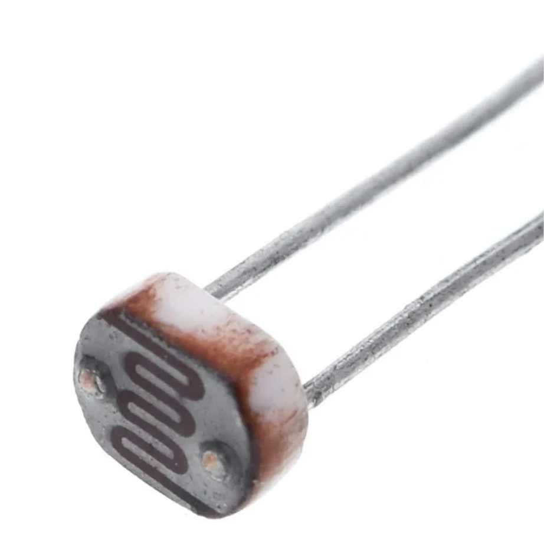
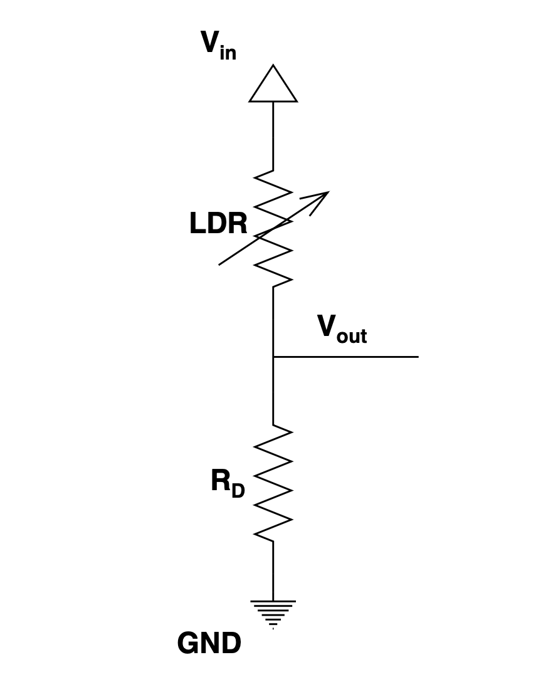
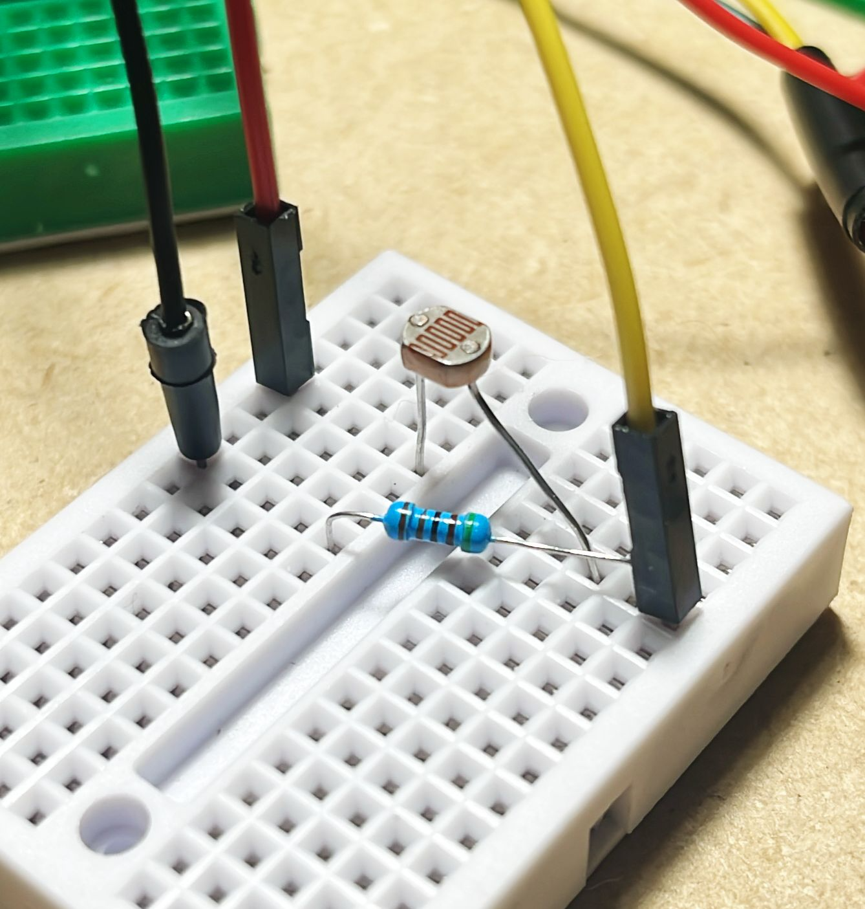

# LDR Voltage Divider Design

This repository contains the design and analysis of a voltage divider circuit using a Light Dependent Resistor (LDR) GL5539. The project aims to characterize the LDR behavior and design an appropriate voltage divider for use with a 3.3V microcontroller (ESP32).

## Project Overview

The project includes:
- Characterization of the GL5539 photoresistor
- Mathematical modeling of the LDR response curve
- Design of a voltage divider circuit
- Analysis of voltage and current behavior under different illuminance conditions

## Key Components

- **Photoresistor**: GL5539 LDR
- **Circuit Design**: Voltage divider with 5kΩ fixed resistor
- **Operating Voltage**: 3.3V (ESP32 compatible)
- **Reference Point**: 1.7V output at 350 lux

## Repository Structure

```
ldr-design/
├── assets/                         # Project images and diagrams
│   ├── circuit_diagram.png         # Voltage divider circuit diagram
│   ├── LDR_GL5539.png              # Photo of the LDR component
│   └── prototype.png               # Prototype implementation photo
├── data/
│   └── LDR_GL5539.csv              # Experimental measurements data
└── voltage_divider_design.ipynb    # Main analysis notebook
```

## Key Findings

From the analysis:
- LDR characteristics:
  - Gamma coefficient: -0.641
  - R₀ coefficient: ~200.5 kΩ
- Voltage divider design:
  - Fixed resistor: 5 kΩ
  - Reference point: 1.7V at 350 lux
  - Operating range: Optimized for 100-600 lux

## Getting Started

### Prerequisites

Take a look at the [pyproject.toml](pyproject.toml) file to see the dependencies.

### Installation

1. Clone the repository.
2. Install [uv](https://docs.astral.sh/uv/).
3. Install dependencies using uv:
   ```bash
   uv sync
   ```

### Usage

Open the Jupyter notebook to view the analysis:
```bash
jupyter lab voltage_divider_design.ipynb
```

## License

This project is licensed under the terms included in the LICENSE file.

## Photoresistor



## Circuit Diagram



## Prototype



## Results

The analysis provides:
- Detailed LDR characterization curves
- Voltage divider response analysis
- Current consumption analysis
- Mathematical model for predicting LDR behavior

The voltage divider design achieves a linear response in the target illuminance range (100-600 lux) and provides appropriate voltage levels for ADC reading with a 3.3V microcontroller.